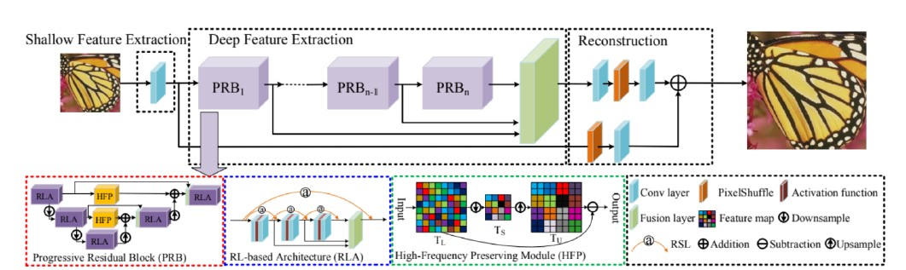

# PRLSR: Progressive Residual Learning for Single Image Super-Resolution

This repository contains the implementation of **PRLSR**, a lightweight and efficient model for Single Image Super-Resolution (SISR). The model is designed to enhance image quality by reconstructing high-resolution (HR) images from low-resolution (LR) inputs, while maintaining low computational cost.

---

## Features
- **Lightweight Architecture**: Utilizes **Progressive Residual Blocks (PRBs)** for effective feature extraction with reduced computational complexity.
- **High-Frequency Preservation**: Employs **High-Frequency Preservation (HFP)** modules to retain essential image details.
- **Residual Learning Architecture (RLA)**: Mitigates vanishing gradient problems and improves feature representation.
- **DIV2K Dataset**: Trained on the high-quality DIV2K dataset, consisting of 800 training and 100 testing image pairs.

---

## Results
The model achieves state-of-the-art performance:

| Metric       | Value  |
|--------------|--------|
| **PSNR**     | 25.32  |
| **SSIM**     | 0.967  |

---

## Model Architecture


### Key Components:
1. **Progressive Residual Blocks (PRBs)**: Gradually downsample and upsample features to reduce redundancy while maintaining image quality.
2. **High-Frequency Preservation (HFP) Modules**: Retain critical high-frequency details during feature map transformations.
3. **Residual Learning Architecture (RLA)**: Improves gradient flow and deepens feature extraction capabilities.


---

## Citation
This implementation is based on the paper **"A Fast and Accurate Super-Resolution Network Using Progressive Residual Learning"**. If you find this work useful, please cite the original paper:

[ResearchGate: A Fast and Accurate Super-Resolution Network Using Progressive Residual Learning](https://www.researchgate.net/publication/341084598_A_Fast_and_Accurate_Super-Resolution_Network_Using_Progressive_Residual_Learning)

```bibtex
@article{prlsr2020,
  title={A Fast and Accurate Super-Resolution Network Using Progressive Residual Learning},
  author={H. Liu, Z. Lu, W. Shi and J. Tu},
  booktitle={ICASSP},
  year={2020},
  publisher={IEEE}
}
```